# Selected Photography

**Digital**\
Canon EOS 1300D with a 50mm f/1.8 and 18-55mm f/3.5-5.6.

**Film**\
  A beautiful Nikkormat FT2 with a Nikon 50mm f/1.4 and a small Minox GTE.

---

<!-- ++++++++++++++++++++++++++++++++++++++++++++++++++++++++++++++++++++++++++++++++++++++++++++ -->
<!--                                       FLOWER                                                 -->
<!-- ++++++++++++++++++++++++++++++++++++++++++++++++++++++++++++++++++++++++++++++++++++++++++++ -->

    

        
        
        
    

  
  ## Analog flowers
  

  

    
  

  

    
  

  

    
  

  

    
  

----------------------------------

<!-- ++++++++++++++++++++++++++++++++++++++++++++++++++++++++++++++++++++++++++++++++++++++++++++ -->
<!--                                       GREENHOUSE                                             -->
<!-- ++++++++++++++++++++++++++++++++++++++++++++++++++++++++++++++++++++++++++++++++++++++++++++ -->

    

        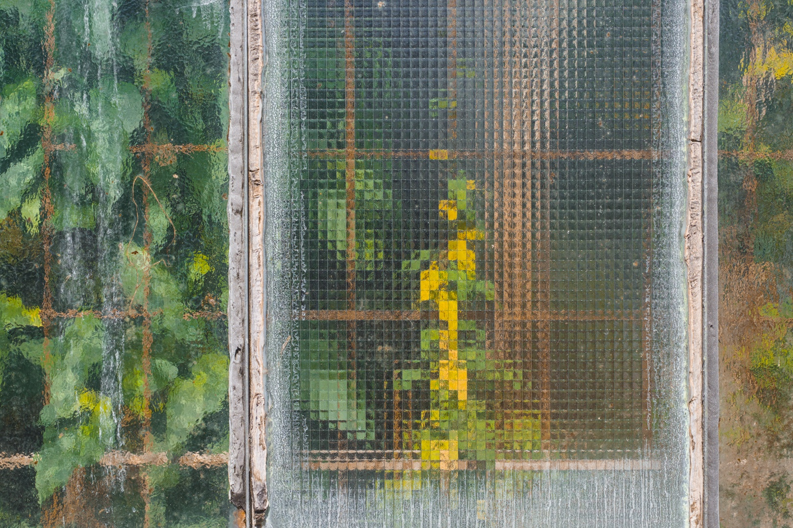
        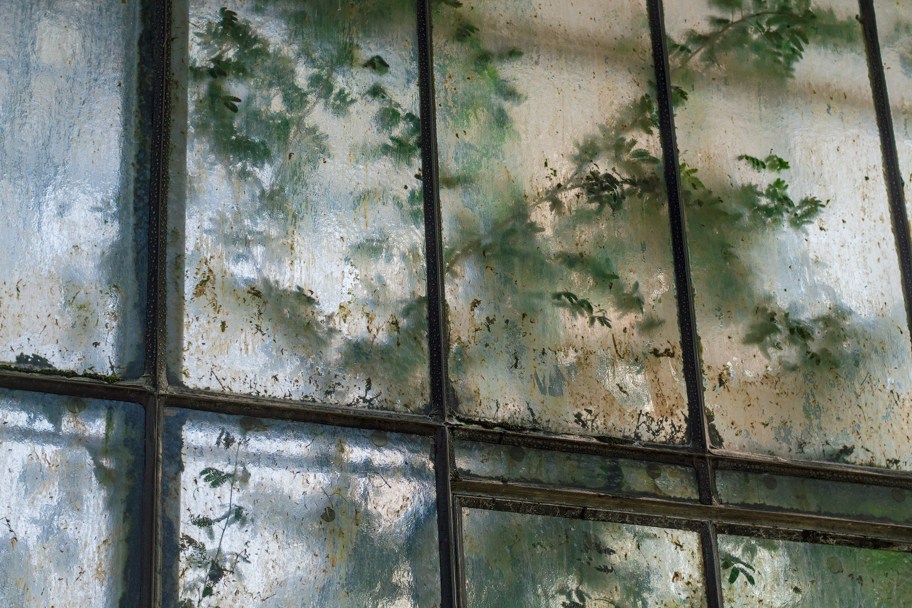
        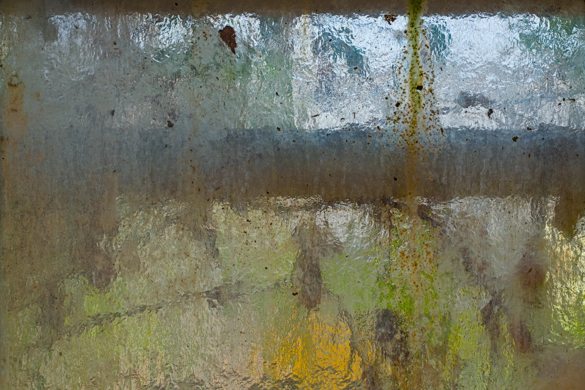
    

  
  ## Greenhouse
  

  

    
  

  

    
  

  

    
  

  

    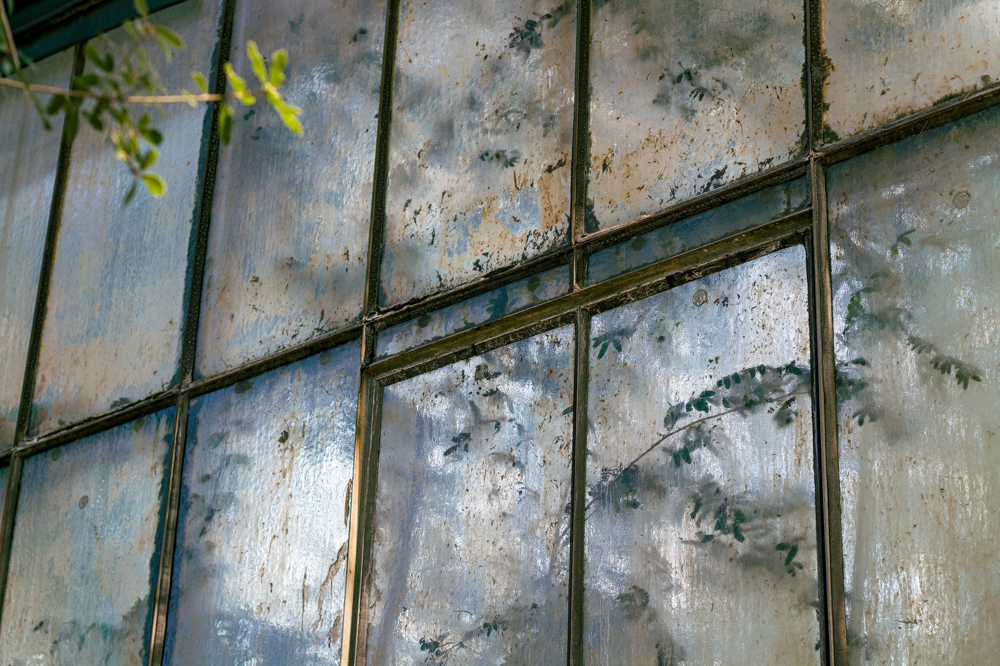
  

  

    
  

  

    
  

----------------------------------

<!-- ++++++++++++++++++++++++++++++++++++++++++++++++++++++++++++++++++++++++++++++++++++++++++++ -->
<!--                                       BLACKFOREST                                            -->
<!-- ++++++++++++++++++++++++++++++++++++++++++++++++++++++++++++++++++++++++++++++++++++++++++++ -->

    

        
        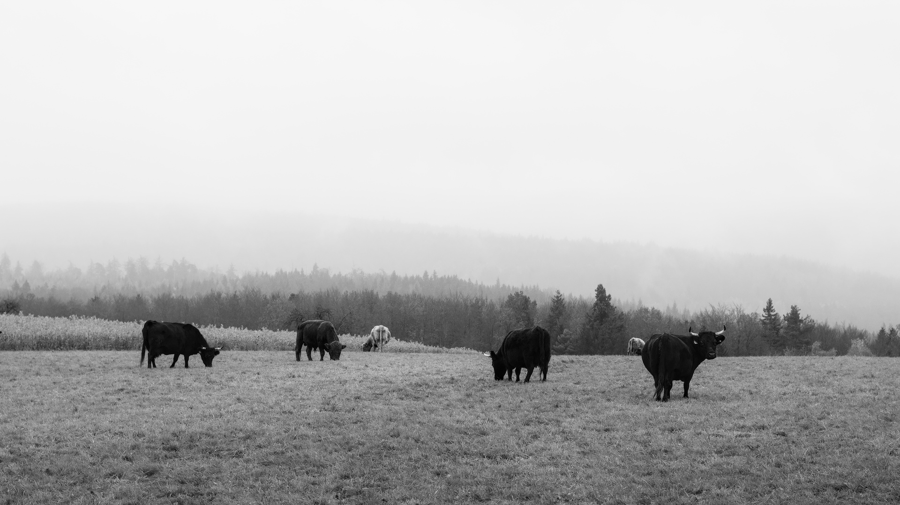
    

 
  
  ## B/W
  

  

    
  

  

    
  

----------------------

<!-- ++++++++++++++++++++++++++++++++++++++++++++++++++++++++++++++++++++++++++++++++++++++++++++ -->
<!--                                       B/W Planar                                             -->
<!-- ++++++++++++++++++++++++++++++++++++++++++++++++++++++++++++++++++++++++++++++++++++++++++++ -->

    

        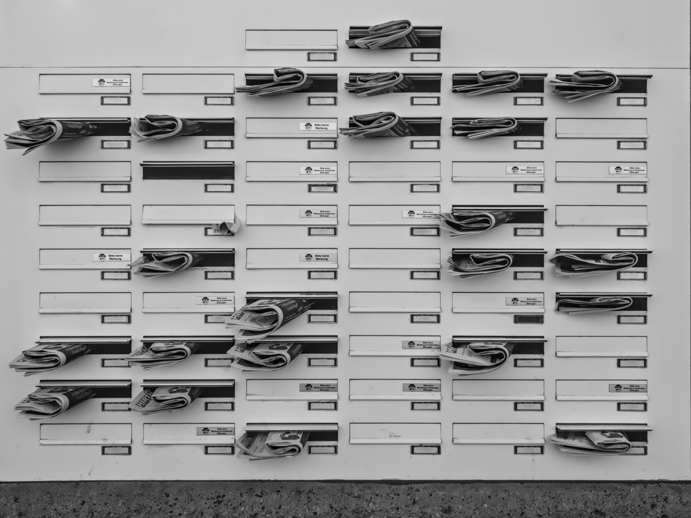
        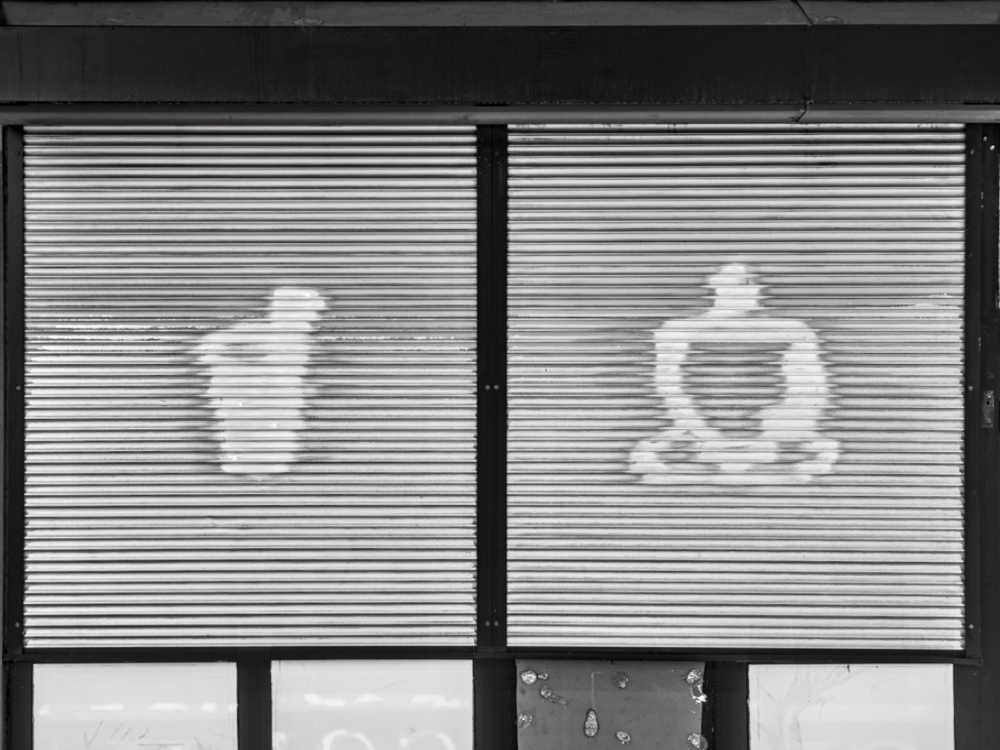
        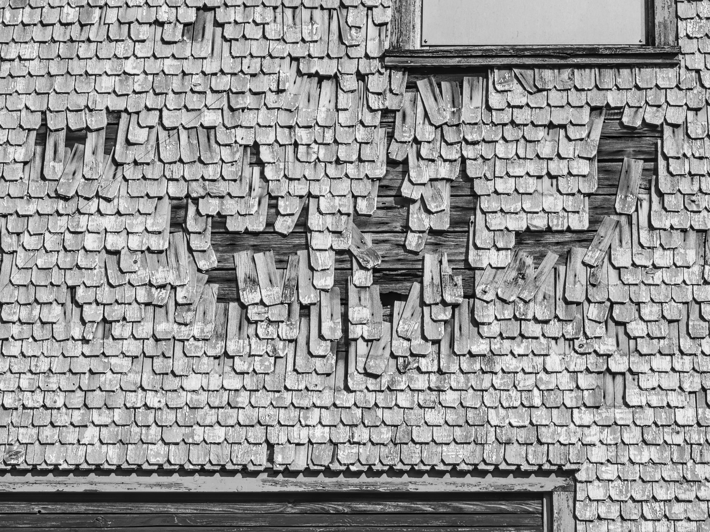
    

 

## B/W Planar

  

    
  

  

    
  

  

    
  

  

    
  

----------------------------------

<!-- ++++++++++++++++++++++++++++++++++++++++++++++++++++++++++++++++++++++++++++++++++++++++++++ -->
<!--                                       INDUSTRIAL-A                                           -->
<!-- ++++++++++++++++++++++++++++++++++++++++++++++++++++++++++++++++++++++++++++++++++++++++++++ -->

    

        
        
        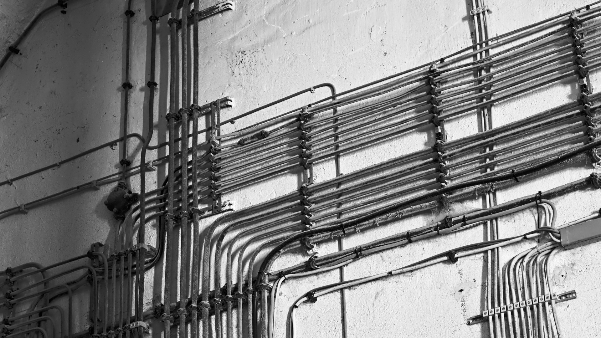
    

 

## Industrial-A

  

    
  

  

    
  

  

    
  

  

    
  

  

----------------------------------

<!-- ++++++++++++++++++++++++++++++++++++++++++++++++++++++++++++++++++++++++++++++++++++++++++++ -->
<!--                                       INDUSTRIAL-B                                           -->
<!-- ++++++++++++++++++++++++++++++++++++++++++++++++++++++++++++++++++++++++++++++++++++++++++++ -->

    

        
        
        
    

 

## Industrial-B

  

    
  

  

    
  

  

    
  

  

    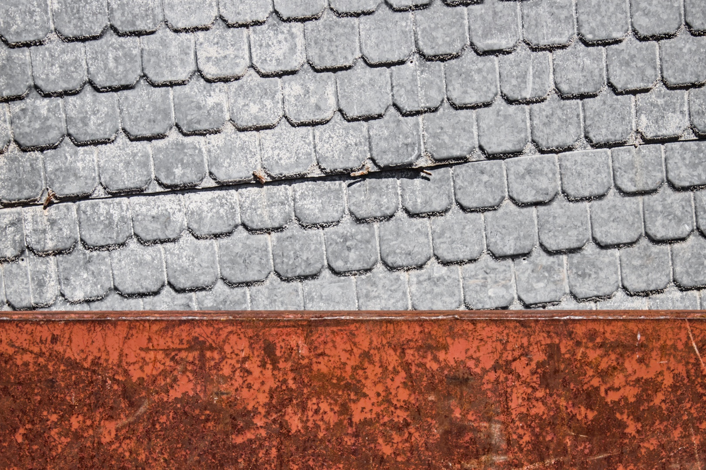
  

  

    
  

  

    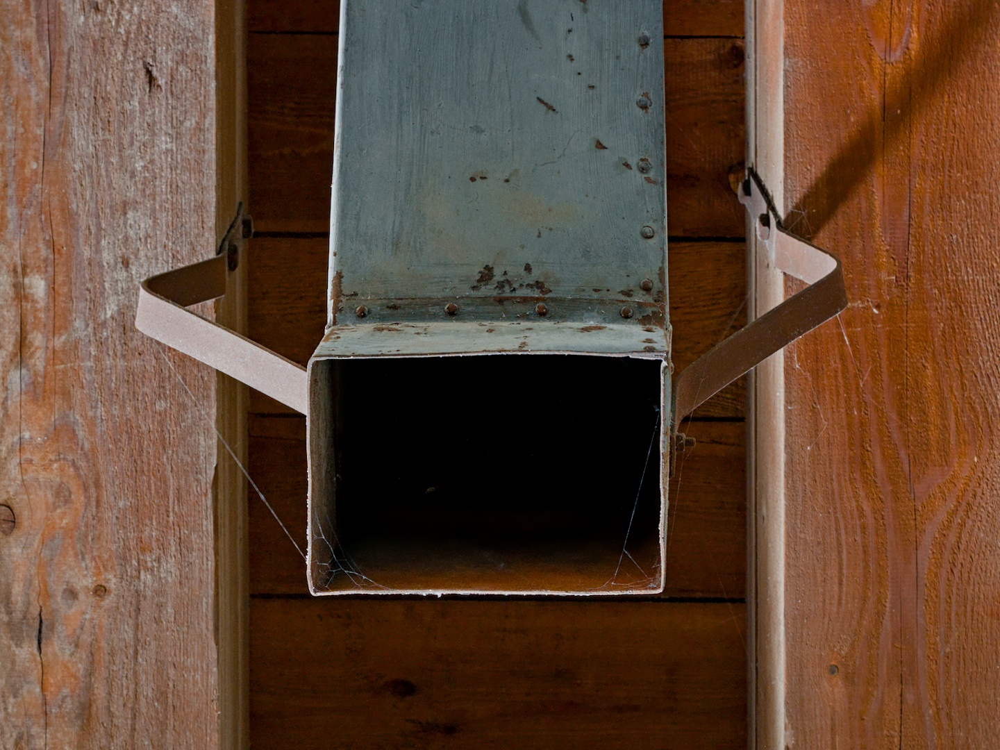
  

  

----------------------------------

<!-- ++++++++++++++++++++++++++++++++++++++++++++++++++++++++++++++++++++++++++++++++++++++++++++ -->
<!--                                       INDUSTRIAL-TYPOGRAPHY                                  -->
<!-- ++++++++++++++++++++++++++++++++++++++++++++++++++++++++++++++++++++++++++++++++++++++++++++ -->

    

        
        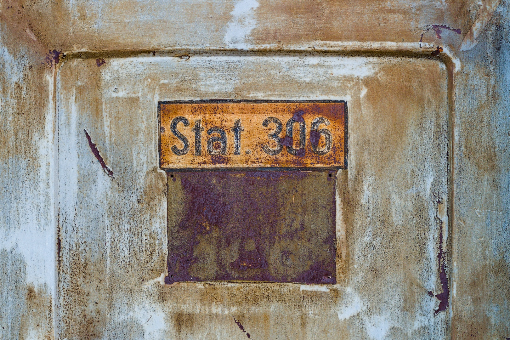
        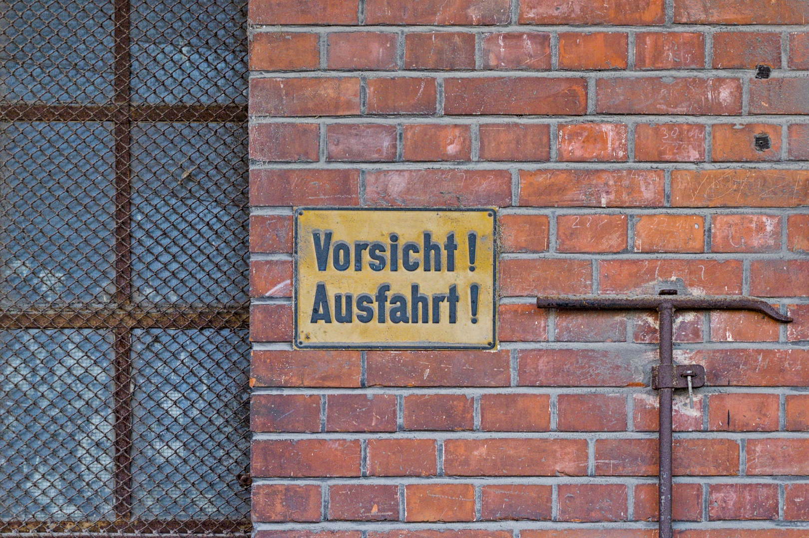
    

 

## Industrial-B

  

    
  

  

    
  

  

    
  

  

    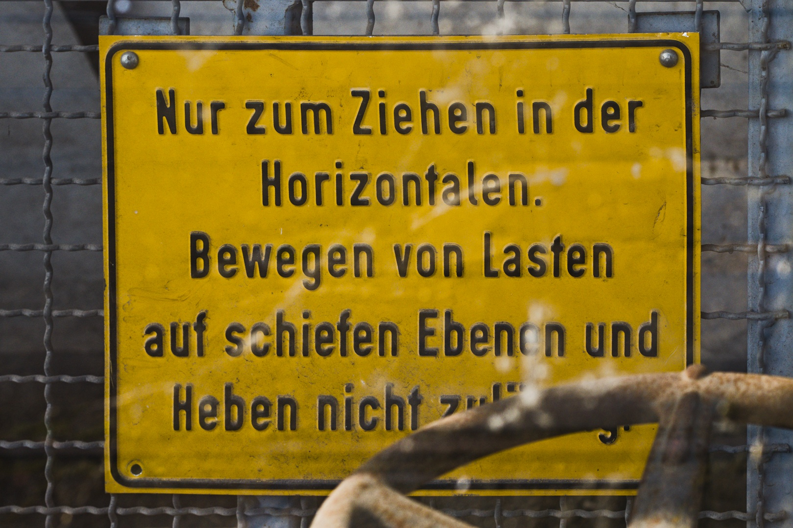
  

  

----------------------------------

&#169 2025 LEMettler. All rights reserved.

